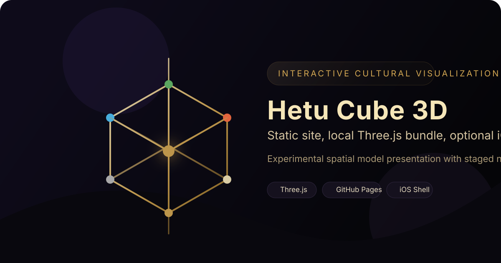

<div align="center">
  
  <h1>hetu-cube-3d</h1>
  <p>河图洛书交互学习器：把河图立方体、洛书九宫、数理对照、入门讲解和知识测验整合到一个静态网页中。</p>
  <p>
    
    
    
    
  </p>
</div>

这是一个基于 `Three.js` 的交互式静态前端项目。新版首页从单一的“河图立方体 3D 展示”扩展为“河图洛书交互学习器”，同时提供河图立方体、洛书九宫、河图与洛书对照、概念卡、入门步骤和知识测验。

## 项目定位

这个项目适合被理解为：

- 一个文化主题的交互可视化作品
- 一个面向初学者的河图洛书学习页面
- 一个实验性三维模型与九宫格对照展示
- 一个适合继续封装成 GitHub Pages 或 App 原型的静态前端样例

它不应被默认理解为：

- 学术定论
- 历史定论
- 科学证明

## 核心特性

- 单页静态网页，直接打开或静态托管即可运行
- 本地打包 `Three.js`，不依赖外部 CDN
- 支持河图立方体、洛书九宫和二者对照三种学习视图
- 内置阶段式演化播放、聚焦查看、讲解提示和顶点详情面板
- 新增概念卡、入门引导、知识测验和分享入口
- 同时兼顾桌面浏览和移动端展示
- 附带 `WKWebView` 封装壳，便于继续做 iPhone / iPad 原型

## 在线访问与 GitHub Pages

仓库根目录已经提供 `index.html`，可以直接作为 GitHub Pages 入口文件使用。

当前线上地址：

```text
https://jbbom.github.io/hetu-cube-3d/
```

仓库中已经放置 `.nojekyll`，避免静态资源在 Pages 上被 Jekyll 干扰。

## 本地运行

方式 1：直接打开 `index.html`。

方式 2：使用本地静态服务。

```bash
python3 -m http.server 8080
```

然后访问：

```text
http://127.0.0.1:8080/
```

## iOS 壳工程

`HetuCubeIOS/` 目录提供一个基于 `SwiftUI + WKWebView` 的轻量壳工程，可用于：

- 快速把网页版封装成 iOS 演示原型
- 验证本地静态资源在 App 内的加载效果
- 在不重写前端逻辑的前提下继续延展成轻应用

当前壳工程会优先加载 `Web/index.html`，并随仓库同步新版 `assets/` 静态资源。

## 仓库结构

```text
hetu-cube-3d/
├── index.html
├── assets/
│   ├── index-*.css
│   └── index-*.js
├── hetu-cube.html
├── three.min.js
├── docs/
│   └── assets/
│       └── hetu-cube-banner.svg
├── HetuCubeIOS/
│   └── HetuCubeIOS/
│       ├── ContentView.swift
│       ├── HetuCubeApp.swift
│       ├── HetuWebView.swift
│       └── Web/
├── README.md
├── LICENSE
└── THIRD_PARTY_NOTICES.md
```

## 技术信息

- 渲染引擎：`Three.js`
- 页面形态：静态 HTML + 打包后的 JS/CSS
- 交互方式：轨道控制、射线拾取、阶段动画、聚焦切换、九宫格对照、概念卡与测验
- 发布方式：本地打开、静态服务器、GitHub Pages、iOS WebView

## 第三方依赖

- `three.min.js`
  - 来源：Three.js r128
  - 许可证：MIT

详细说明见 [THIRD_PARTY_NOTICES.md](THIRD_PARTY_NOTICES.md)。

## 许可证

本项目采用 [MIT License](LICENSE)。
